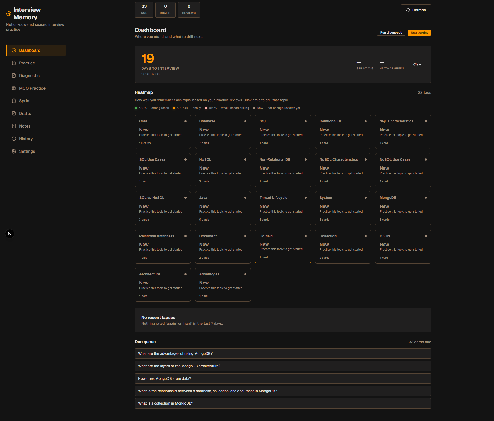
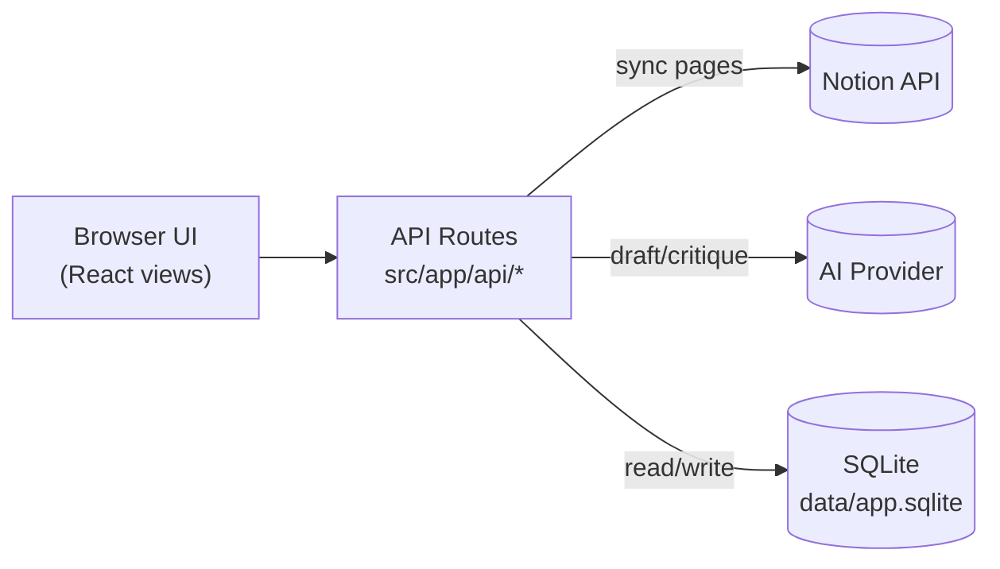

# Notion Interview Memory

A private local web app that turns a Notion knowledge database into interview-style
spaced review practice.



## What It Does

- Syncs selected pages from one Notion database into local notes.
- Converts synced notes into open-recall card drafts and multiple-choice questions (MCQs) via AI.
- Open-recall drafts require approval before entering review; MCQs are auto-approved and used as a diagnostic breadth scanner.
- **Dashboard home:** Interview-date countdown, tag-level retention Heatmap, recent Lapses tile, and Due Queue in one view.
- **Interview Date + FSRS clamp:** Set a single target date; scheduler caps `scheduledDays` to `daysUntil − 1` so every card gets one more review before the interview.
- **MCQ Diagnostic:** 15-question weakness scanner weighted toward stale/cold tags; ends with a Weakness Report + one-click "Drill these tags" open-recall handoff.
- **Sprint:** Fixed 20-item pressure test (~50/50 MCQ + open-recall, 70% weighted to red/yellow tags) with full FSRS updates and score history.
- Supports optional AI answer critique while keeping the final grade user-controlled.
- Merges open-recall and MCQ reviews into a unified history timeline with type badges.
- Supports tag filtering across practice, drafts, and history views.
- Stores all learning state locally in SQLite under `data/app.sqlite`.

## Cramming Quickstart

Optimized for a job seeker with a 3–6 week interview runway:

1. **Set your Interview Date** — the dashboard countdown becomes your north star; every FSRS schedule clamps to it.
2. **Run an MCQ Diagnostic** — 15 questions, ~8 min. The Weakness Report tells you which 1–3 tags to drill.
3. **Drill the weak tags** — one-click handoff from Weakness Report or Heatmap tile → open-recall practice filtered to that tag.
4. **Weekly Sprint** — 20 items, same shape every time so you can benchmark yourself week-over-week. Score feeds the Countdown running average.
5. **Night-before ritual** — the Lapses tile shows every card you rated `again` or `hard` in the last 7 days; one click drills them.

## Architecture



The UI calls the API routes for everything. The routes sync content from Notion,
call the configured AI provider to draft cards/MCQs and critique answers, run the
spaced-repetition scheduling logic, and persist it all to a local SQLite file.

## Tech Stack

| Layer | Technology |
|-------|-----------|
| Runtime | Bun `>=1.1.0` |
| Framework | Next.js 14 (App Router) + React 18 |
| Language | TypeScript (ESM) |
| Database | `bun:sqlite` |
| Test Runner | `bun test` |
| Design System | Orange/Geist High-Contrast Modern (via Google Stitch MCP) |

## Quick Start

```sh
# Ensure Bun is installed (https://bun.sh) or use the local binary:
# /Users/golden-owl/.bun/bin/bun

bun install
bun test
bun run dev
```

Open `http://localhost:3000`.

## Offline Mode

No Notion setup or API keys needed to try the flow: leave the AI provider set to
`offline` in Settings and the deterministic local provider generates cards, MCQs,
and critiques.

## Study Roadmaps

`docs/roadmaps.md` holds the study roadmaps for the interview runway. Register
them as notes (they are local, not Notion pages):

```sh
bun scripts/seed-roadmaps.ts            # or: bun scripts/seed-roadmaps.ts <path-to-markdown>
```

Each `# R<n> — ...` section becomes one note tagged `Roadmap` + the section key.
Once seeded, they behave like any other note: Generate Drafts, approve into cards,
and MCQ generation picks them up for the diagnostic. The command is idempotent —
re-running updates the notes in place instead of duplicating them. Notion sync only
upserts the pages it fetches, so it never removes them.

To remove them again:

```sql
DELETE FROM notes WHERE notion_page_id LIKE 'local:roadmap-%';
```

## Revision Checklist

Use the separate **Checklist** view to work through the four parts of your interview syllabus. Each topic has its own completion checkbox and key takeaway. Your checklist progress and takeaways stay in local SQLite; source status marks remain separate from your progress.

Import the source file from the sibling `career-ops` repository:

```sh
bun scripts/import-checklist.ts
```

The default path is `../career-ops/interview-prep/revision-checklist.md`, relative to the app folder. Pass a different file as an argument or set `CHECKLIST_FILE`:

```sh
bun scripts/import-checklist.ts /path/to/revision-checklist.md
CHECKLIST_FILE=/path/to/revision-checklist.md bun scripts/import-checklist.ts
```

In PowerShell, set the environment variable before running the command:

```powershell
$env:CHECKLIST_FILE = 'C:\path\to\revision-checklist.md'
bun scripts/import-checklist.ts
```

The importer stores a local snapshot in `data/app.sqlite`. Re-importing the same items preserves their checked state and takeaways. Removed items are archived, not deleted. The source markdown stays in `career-ops` and is not copied into this repository.

## Project Structure

```
src/
├── app/
│   ├── api/              Next.js API route handlers
│   │   ├── checklist/    GET active items and PATCH completion/takeaway
│   │   ├── dashboard/    GET dashboard payload (countdown + heatmap + lapses + due queue)
│   │   ├── interview-date/  GET/POST Interview Date
│   │   ├── sprints/      POST start / :id/complete
│   │   └── mcq-diagnostics/  POST start / :id/complete
│   ├── globals.css       Global styles (Orange/Geist tokens, typography)
│   ├── layout.tsx        Root layout
│   └── page.tsx          Thin SPA shell — component map + view routing
├── components/
│   ├── ui/               Primitives: Button, Card, Toast, MetricCard, Icons
│   ├── Sidebar.tsx       Navigation sidebar (Dashboard/Practice/Diagnostic/Sprint/…)
│   ├── TopBar.tsx        Stats bar
│   ├── DashboardView.tsx    Home — Countdown + Heatmap grid + Lapses + Due Queue
│   ├── Countdown.tsx     Mission-control countdown (days · sprint avg · % green)
│   ├── HeatmapTile.tsx   Tag tile: retention %, trend arrow, status dot, cold-state
│   ├── LapsesTile.tsx    Recent lapses + one-click drill
│   ├── OpenRecallView.tsx    Open-recall answer → critique → self-grade
│   ├── MCQPracticeView.tsx   MCQ Diagnostic session + Weakness Report + drill handoff
│   ├── SprintView.tsx    Fixed 20-item timed sprint + score summary
│   ├── DraftsView.tsx    Draft approval queue + Generate MCQs
│   ├── NotesView.tsx     Synced note list
│   ├── RoadmapsView.tsx  Compact R1–R10 roadmap disclosures
│   ├── ChecklistView.tsx Searchable four-part revision checklist
│   ├── HistoryView.tsx   Merged timeline (open-recall + MCQ reviews)
│   └── SettingsView.tsx  Notion & AI config form
├── hooks/
│   └── useAppState.ts    All state + event handlers extracted from page.tsx
├── lib/
│   ├── ai.ts             AI provider interface & output parsing
│   ├── api-client.ts     Typed fetch wrappers for the API routes
│   ├── countdown.ts      Pure countdown-payload assembly (days, sprint avg, green %)
│   ├── checklist.ts      Revision-checklist markdown parser and stable item keys
│   ├── database.ts       SQLite CRUD (includes clamp integration in recordReview)
│   ├── heatmap.ts        Pure computeHeatmap — retention rate, trend, cold tags
│   ├── lapses.ts         Pure computeLapses — recent again/hard reviews
│   ├── mcq-diagnostic.ts Pure pickDiagnosticMCQs + computeWeaknessReport
│   ├── migrate.ts        SQL migration runner
│   ├── notion.ts         Notion API sync & block extraction
│   ├── scheduler.ts      FSRS-style spaced repetition + applyInterviewDateClamp
│   ├── sprint.ts         Pure pickSprintItems + computeSprintScore
│   └── with-db.ts        Route wrapper: open/close SQLite, errors → 400
└── migrations/
    ├── 001-initial.ts     Core schema (notes, drafts, cards, schedules, reviews)
    ├── 002-mcq-questions.ts  mcq_questions table
    ├── 003-mcq-reviews.ts    mcq_reviews table
    ├── 004-sprints-and-diagnostics.ts  sprints + mcq_diagnostics session tables
    └── 005-revision-checklist.ts        local checklist and takeaway storage
```

## Configuration

Configure the app in the **Settings** screen (recommended) or via environment
variables (see `.env.example`).

### Notion Setup

1. Create a Notion integration and copy its internal integration token.
2. Share your knowledge database with that integration.
3. Enter the database ID, title property, topic property, and topic filters.

### AI Setup

- `offline` — works without network or keys. Useful for testing the full flow.
- `openai-compatible` — calls a `/chat/completions` endpoint. Requires API key,
  base URL, and model name.

## Review Flow

### Open-Recall (Cards)

1. Sync selected Notion topics.
2. Generate drafts from a synced note.
3. Approve useful drafts.
4. Practice due cards.
5. Optionally request AI critique.
6. Self-grade with `Again`, `Hard`, `Good`, or `Easy`.

The self-grade is the only input used for scheduling.

### Multiple Choice (MCQs)

1. MCQs are auto-generated alongside drafts and auto-approved — no approval step.
2. Practice MCQs from the sidebar; options shuffle on load.
3. Select an answer — correctness is recorded immediately in review history.
4. Navigate between questions using numbered circles; answered state persists per session.

### Revision Checklist

1. Run `bun scripts/import-checklist.ts` to import the sibling career-ops checklist.
2. Open **Checklist**, choose a Part, then expand a category.
3. Check a topic when you finish it. Add a key takeaway and save it.
4. Search across all Parts when you need to find a specific topic.

The checklist is separate from Notion notes. The existing **Roadmaps** view still contains R1–R10.

### History

Both review types appear in a merged timeline on the History screen, with type badges
(`Open Recall` / `Multiple Choice`) and filterable by type and tag.

## Design System

The UI uses the **Orange/Geist High-Contrast Modern** design system generated via
Google Stitch MCP.

| Token | Value |
|-------|-------|
| Background | `#131313` |
| Panels | `#201f1f` |
| Primary accent | `#ff9800` |
| Body font | Geist |
| Label font | JetBrains Mono |
| Border radius | 4px |
| Spacing grid | 8px base |

Stitch project: `projects/6935587743182712761`

## Scripts

| Command | Description |
|---------|-------------|
| `bun run dev` | Start development server |
| `bun run build` | Production build |
| `bun run start` | Production server |
| `bun run lint` | Run ESLint |
| `bun test` | Run test suite |
